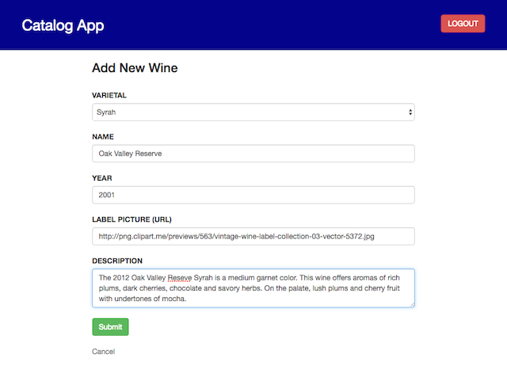
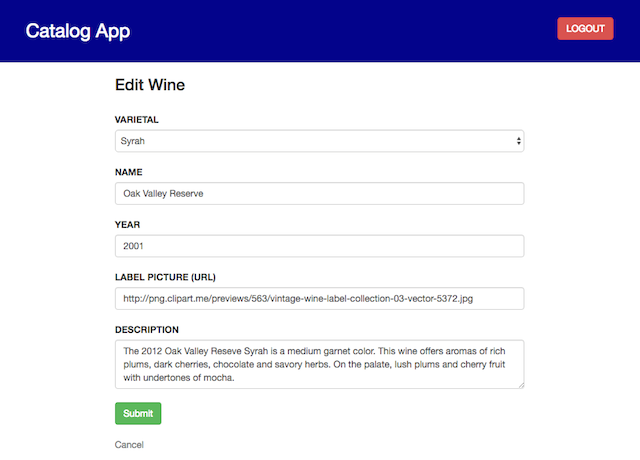

# Udacity Fullstack ND P3 Catalog App

## Description

This project implements an application that provides a list of items within a variety of categories as well as provide a user registration and authentication system. Registered users will have the ability to post, edit and delete their own items. Specifically this app manages a wine collection.

## How to Start

This project assumes that you have Vagrant installed on your machine. These instructions are for OSX or Unix host.

* Execute below instruction in a shell on your host machine:


```
    host$ git clone https://github.com/cg94301/fullstack-nanodegree-catalog.git
    host$ cd fullstack-nanodegree-catalog/vagrant
    host$ vagrant up
    host$ vagrant ssh
    vagrant$ cd /vagrant/catalog
    vagrant$ python dbinit.py
    vagrant$ python dbpopulate.py
    Added wines!
    vagrant$ python application.py
```

The Vagrant VM relays the application at http://localhost:5000/ to your local machine. Open your browser of choice on your host platform and go to this URL.

* Go to http://localhost:5000/:


* Click on any of the varietals in the left column to select all wines in that varietal:


* Click on any of the listed wines to get its description:


## API endpoints

### JSON API endpoints

* You can point your browser to below JSON API endpoints:

http://localhost:5000/catalog/JSON/

http://localhost:5000/catalog/1/wines/JSON/

http://localhost:5000/catalog/wine/1/JSON/

```
{
  "wine": {
    "description": "The 2013 growing season was another great one in Napa Valley. Deep, red and opulent in color, this wine opens with the vibrant scent of dark cherry and blackberry, subtly layered with warm notes of vanilla. The palate is explosive, bright, balanced - cassis at the center, with flourishes of cocoa and sweet tobacco that provide nuance and continually shifting points of interest. Velvety meshed tannins make this wine lush yet structured, with a texture that grabs attention, expands and unfolds. Fruit, oak and acidity are held in balance throughout the long, drawn-out finish.",
    "id": 1,
    "label": "/static/158729le.png",
    "name": "Caymus Napa Valley",
    "varietal_id": 1,
    "year": 2013
  }
}
```

### XML API endpoints

* You can point your browser to below XML API endpoints:

http://localhost:5000/catalog/XML/

http://localhost:5000/catalog/1/wines/XML/

http://localhost:5000/catalog/wine/1/XML/

```
<catalog>
  <wine>
    <item>
      <description>The 2013 growing season was another great one in Napa Valley. Deep, red and opulent in color, this wine opens with the vibrant scent of dark cherry and blackberry, subtly layered with warm notes of vanilla. The palate is explosive, bright, balanced - cassis at the center, with flourishes of cocoa and sweet tobacco that provide nuance and continually shifting points of interest. Velvety meshed tannins make this wine lush yet structured, with a texture that grabs attention, expands and unfolds. Fruit, oak and acidity are held in balance throughout the long, drawn-out finish.</description>
      <name>Caymus Napa Valley</name>
      <label>/static/158729le.png</label>
      <year>2013</year>
      <id>1</id>
      <varietal_id>1</varietal_id>
    </item>
  </wine>
</catalog>

```

## CRUD operations

You need a file called client_secrects.json in the vagrant/catalog directory. This file has the credentials for Google OAuth2 API. You need to go to developers.google.com and create your own OAuth2 API project. That's because you need your own client_id, client_secret and project_id of your choice. Udacity OAuth class walks you through the process.

* Get your Google+ OAuth API credentials and download them in JSON format:

```
{"web": {"client_id":"YOUR_CLIENT_ID",
        "project_id":"YOUR_PROJECT_ID",
        "auth_uri":"https://accounts.google.com/o/oauth2/auth",
        "token_uri":"https://accounts.google.com/o/oauth2/token",
        "auth_provider_x509_cert_url":"https://www.googleapis.com/oauth2/v1/certs",
        "client_secret":"YOUR_CLIENT_SECRET",
        "redirect_uris":["http://localhost:5000/login","http://localhost:5000/gconnect"],
        "javascript_origins":["http://localhost:5000"]}}
```

Once this file is present you can login via Google+ OAuth. You should see page like below once logged in. Notice the 'Add wine' option which allows you to create your own entry for a wine.

* Log into the app:


### Create

* Go ahead and create your own wine:



### Update

Now that you have created your own wine you can also edit it. 

* Notice the options for 'edit' and 'delete' that showed up:


* Select the wine you just created and click on the 'Edit' option:



### Delete

* Selecting 'Delete' instead allows you to delete the wine you created:


## Wrap Up and Exit

* When done editing click on 'Logout' to log out of the app.

* Execute these commands in your shell when ready to exit:

```
    vagrant$ exit
    host$ vagrant halt
```